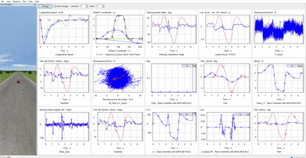

## Steering System Parameter Tuning Using Carsim and Deep Deterministic Policy Gradient

This is python code for comminicating specification of project. (based on yanpanlau github. thaks yanpanlau!!)
So, this code is not perfect of training steering system.
I want to exchange opinions for a better project.

Please read the following blog for details

https://github.com/MoonSeongJoo/MoonSeongJoo.github.io



# Installation Dependencies:

* Python 3.5
* Keras 2.0.6
* Tensorflow r1.0.0
* CarSim 2017.1
* Matlab R2017a

# How to Run?

```
git clone https://github.com/MoonSeongJoo/RLSimulator-SBW-controller-using-reinforcement-learning-.git
cd code
exection matlab R2017a
python EPS_Control_Matlab_1.py 
run Steer_Control_Moon.m
```

(Change the flag **train_indicator**=1 in EPS_Control_Matlab_1.py if you want to train the network)

# Motivation :
 자율주행에 관심이 많았고, 